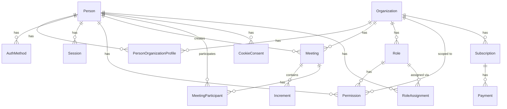

# Data Models for Persistence Layer

## Overview

This document defines the complete database schema and GORM models for the meeting cost calculator application. All models use PostgreSQL as the database engine and GORM as the ORM.

## Database Schema Design Principles

- **Normalization**: Follow 3NF where appropriate, but denormalize for performance when needed
- **Soft Deletes**: Use `DeletedAt` for GDPR compliance and audit trails
- **Timestamps**: All models include `CreatedAt` and `UpdatedAt`
- **UUIDs**: Use UUIDs for primary keys to avoid enumeration attacks
- **Indexes**: Strategic indexes on foreign keys, frequently queried fields, and composite keys
- **Constraints**: Foreign key constraints, unique constraints, and check constraints where appropriate

## Core Entity Models

### Person

Represents a user/person in the system. Can belong to multiple organizations.

```go
type Person struct {
    ID        uuid.UUID `gorm:"type:uuid;primary_key;default:gen_random_uuid()"`
    CreatedAt time.Time
    UpdatedAt time.Time
    DeletedAt gorm.DeletedAt `gorm:"index"`
    
    // Identity fields
    Email     string `gorm:"uniqueIndex;not null"`
    FirstName string `gorm:"not null"`
    LastName  string
    
    // GDPR compliance
    AnonymizedAt *time.Time // Set when person requests data deletion
    Anonymized   bool       `gorm:"default:false"` // Flag for anonymized records
    
    // Relationships
    OrganizationProfiles []PersonOrganizationProfile `gorm:"foreignKey:PersonID"`
    AuthMethods          []AuthMethod                `gorm:"foreignKey:PersonID"`
    Permissions          []Permission                `gorm:"foreignKey:PersonID"`
    CreatedMeetings      []Meeting                   `gorm:"foreignKey:CreatedByID"`
    MeetingParticipants  []MeetingParticipant        `gorm:"foreignKey:PersonID"`
    
    // Metadata
    Timezone string `gorm:"default:'UTC'"`
    Locale   string `gorm:"default:'en-US'"`
}
```

**Indexes:**
- `idx_person_email` on `email`
- `idx_person_deleted_at` on `deleted_at`
- `idx_person_anonymized` on `anonymized`

### Organization

Represents an organization that can have multiple people and meetings.

```go
type Organization struct {
    ID        uuid.UUID `gorm:"type:uuid;primary_key;default:gen_random_uuid()"`
    CreatedAt time.Time
    UpdatedAt time.Time
    DeletedAt gorm.DeletedAt `gorm:"index"`
    
    // Identity
    Name        string `gorm:"not null"`
    Slug        string `gorm:"uniqueIndex;not null"` // URL-friendly identifier
    Description string `gorm:"type:text"`
    
    // Default wage settings
    DefaultWage      float64 `gorm:"type:decimal(10,2);default:0"` // Default hourly wage
    UseBlendedWage  bool    `gorm:"default:false"` // Use blended wage instead of individual
    
    // Relationships
    Members         []PersonOrganizationProfile `gorm:"foreignKey:OrganizationID"`
    Meetings        []Meeting                   `gorm:"foreignKey:OrganizationID"`
    Roles           []Role                      `gorm:"foreignKey:OrganizationID"`
    Permissions     []Permission                `gorm:"foreignKey:OrganizationID"`
    Subscriptions   []Subscription              `gorm:"foreignKey:OrganizationID"`
    
    // Settings
    Settings JSONB `gorm:"type:jsonb"` // Flexible settings storage
}
```

**Indexes:**
- `idx_org_slug` on `slug` (unique)
- `idx_org_deleted_at` on `deleted_at`

### PersonOrganizationProfile

Join table representing the relationship between a Person and Organization, including wage information and membership status.

```go
type PersonOrganizationProfile struct {
    ID        uuid.UUID `gorm:"type:uuid;primary_key;default:gen_random_uuid()"`
    CreatedAt time.Time
    UpdatedAt time.Time
    DeletedAt gorm.DeletedAt `gorm:"index"`
    
    // Foreign keys
    PersonID       uuid.UUID `gorm:"type:uuid;not null;index:idx_person_org"`
    OrganizationID uuid.UUID `gorm:"type:uuid;not null;index:idx_person_org"`
    
    // Membership
    IsActive      bool       `gorm:"default:true"`
    JoinedAt      time.Time  `gorm:"not null"`
    LeftAt        *time.Time // Null if still active
    
    // Wage information (can be null if using organization default)
    HourlyWage    *float64   `gorm:"type:decimal(10,2)"` // Nullable, uses org default if null
    WageUpdatedAt *time.Time
    
    // External IDs for meeting integration
    ExternalIDs JSONB `gorm:"type:jsonb"` // {"zoom": "user123", "teams": "user456", "slack": "U12345"}
    
    // Relationships
    Person       Person       `gorm:"foreignKey:PersonID"`
    Organization Organization `gorm:"foreignKey:OrganizationID"`
}
```

**Indexes:**
- `idx_person_org` composite on `(person_id, organization_id)`
- `idx_person_org_active` on `(person_id, organization_id, is_active)` where `is_active = true`
- `idx_person_org_deleted_at` on `deleted_at`

**Constraints:**
- Unique constraint on `(person_id, organization_id)` where `deleted_at IS NULL`

### Role

Represents a role within an organization that groups permissions together.

```go
type Role struct {
    ID        uuid.UUID `gorm:"type:uuid;primary_key;default:gen_random_uuid()"`
    CreatedAt time.Time
    UpdatedAt time.Time
    DeletedAt gorm.DeletedAt `gorm:"index"`
    
    // Identity
    Name        string `gorm:"not null"`
    Description string `gorm:"type:text"`
    
    // Organization scope
    OrganizationID uuid.UUID `gorm:"type:uuid;not null;index"`
    
    // Relationships
    Organization Organization `gorm:"foreignKey:OrganizationID"`
    Permissions  []Permission `gorm:"foreignKey:RoleID"`
    Assignments  []RoleAssignment `gorm:"foreignKey:RoleID"`
}
```

**Indexes:**
- `idx_role_org` on `(organization_id, name)` (unique within org)
- `idx_role_deleted_at` on `deleted_at`

### RoleAssignment

Links roles to persons within an organization.

```go
type RoleAssignment struct {
    ID        uuid.UUID `gorm:"type:uuid;primary_key;default:gen_random_uuid()"`
    CreatedAt time.Time
    UpdatedAt time.Time
    DeletedAt gorm.DeletedAt `gorm:"index"`
    
    RoleID           uuid.UUID `gorm:"type:uuid;not null;index:idx_role_assignment"`
    PersonID         uuid.UUID `gorm:"type:uuid;not null;index:idx_role_assignment"`
    OrganizationID   uuid.UUID `gorm:"type:uuid;not null;index:idx_role_assignment"`
    
    // Relationships
    Role         Role         `gorm:"foreignKey:RoleID"`
    Person       Person       `gorm:"foreignKey:PersonID"`
    Organization Organization `gorm:"foreignKey:OrganizationID"`
}
```

**Indexes:**
- `idx_role_assignment` composite on `(role_id, person_id, organization_id)` (unique)
- `idx_role_assignment_deleted_at` on `deleted_at`

### Permission

Polymorphic permission model that can be attached to either a Role or a Person directly.

```go
type Permission struct {
    ID        uuid.UUID `gorm:"type:uuid;primary_key;default:gen_random_uuid()"`
    CreatedAt time.Time
    UpdatedAt time.Time
    DeletedAt gorm.DeletedAt `gorm:"index"`
    
    // Polymorphic association
    ResourceType string    `gorm:"type:varchar(50);not null;index"` // "role" or "person"
    ResourceID   uuid.UUID `gorm:"type:uuid;not null;index"`
    
    // Permission details
    ResourceName string `gorm:"not null"` // e.g., "meeting", "organization", "person"
    ResourceID   uuid.UUID `gorm:"type:uuid"` // Specific resource ID, null for all resources
    Activity     string `gorm:"type:varchar(20);not null"` // "create", "read", "update", "delete"
    Allowed      bool   `gorm:"default:true"`
    
    // Relationships (polymorphic)
    Role   *Role   `gorm:"polymorphic:Resource;polymorphicValue:role"`
    Person *Person `gorm:"polymorphic:Resource;polymorphicValue:person"`
    
    // Organization scope
    OrganizationID uuid.UUID `gorm:"type:uuid;not null;index"`
    Organization    Organization `gorm:"foreignKey:OrganizationID"`
}
```

**Indexes:**
- `idx_permission_resource` on `(resource_type, resource_id)`
- `idx_permission_org` on `(organization_id, resource_name, activity)`
- `idx_permission_deleted_at` on `deleted_at`

**Note:** The polymorphic relationship in GORM requires careful handling. Consider using explicit foreign keys instead if performance becomes an issue.

### Meeting

Represents a meeting with its metadata and associated increments.

```go
type Meeting struct {
    ID        uuid.UUID `gorm:"type:uuid;primary_key;default:gen_random_uuid()"`
    CreatedAt time.Time
    UpdatedAt time.Time
    DeletedAt gorm.DeletedAt `gorm:"index"`
    
    // Organization scope
    OrganizationID uuid.UUID `gorm:"type:uuid;not null;index"`
    
    // Meeting metadata
    Purpose      string     `gorm:"type:text"`
    StartedAt    *time.Time // Null if not started
    StoppedAt    *time.Time // Null if still running
    IsActive     bool       `gorm:"default:false"`
    
    // Deduplication
    ExternalID   string     `gorm:"index:idx_meeting_external"` // Zoom/Teams/Slack meeting ID
    ExternalType string     `gorm:"type:varchar(50)"` // "zoom", "teams", "slack", "google"
    DeduplicationHash string `gorm:"index:idx_meeting_dedup"` // Hash for deduplication
    
    // Creator
    CreatedByID uuid.UUID `gorm:"type:uuid;not null;index"`
    
    // Relationships
    Organization      Organization       `gorm:"foreignKey:OrganizationID"`
    CreatedBy         Person             `gorm:"foreignKey:CreatedByID"`
    Increments        []Increment        `gorm:"foreignKey:MeetingID;order:start_time"`
    Participants      []MeetingParticipant `gorm:"foreignKey:MeetingID"`
    
    // Computed fields (cached for performance)
    TotalCost      float64 `gorm:"type:decimal(12,2);default:0"`
    TotalDuration  int     `gorm:"default:0"` // seconds
    MaxAttendees   int     `gorm:"default:0"`
}
```

**Indexes:**
- `idx_meeting_org` on `(organization_id, created_at)`
- `idx_meeting_external` on `(external_type, external_id)` where `external_id IS NOT NULL`
- `idx_meeting_dedup` on `deduplication_hash`
- `idx_meeting_active` on `(organization_id, is_active)` where `is_active = true`
- `idx_meeting_deleted_at` on `deleted_at`

### Increment

Represents a time slice of a meeting with specific attendee count and wage settings.

```go
type Increment struct {
    ID        uuid.UUID `gorm:"type:uuid;primary_key;default:gen_random_uuid()"`
    CreatedAt time.Time
    UpdatedAt time.Time
    DeletedAt gorm.DeletedAt `gorm:"index"`
    
    // Foreign key
    MeetingID uuid.UUID `gorm:"type:uuid;not null;index"`
    
    // Time boundaries
    StartTime time.Time `gorm:"not null;index:idx_increment_time"`
    StopTime  time.Time `gorm:"not null;index:idx_increment_time"`
    
    // Increment details
    AttendeeCount int     `gorm:"not null"`
    AverageWage   float64 `gorm:"type:decimal(10,2);not null"`
    
    // Computed fields
    ElapsedTime int     `gorm:"not null"` // seconds
    Cost         float64 `gorm:"type:decimal(12,2);not null"`
    TotalCost    float64 `gorm:"type:decimal(12,2);not null"` // Running total at end of increment
    
    // Purpose (copied from meeting at increment creation)
    Purpose string `gorm:"type:text"`
    
    // Relationships
    Meeting Meeting `gorm:"foreignKey:MeetingID"`
}
```

**Indexes:**
- `idx_increment_meeting` on `(meeting_id, start_time)`
- `idx_increment_time` on `(start_time, stop_time)`
- `idx_increment_deleted_at` on `deleted_at`

### MeetingParticipant

Tracks which people participated in a meeting (for analytics and cost calculation).

```go
type MeetingParticipant struct {
    ID        uuid.UUID `gorm:"type:uuid;primary_key;default:gen_random_uuid()"`
    CreatedAt time.Time
    UpdatedAt time.Time
    DeletedAt gorm.DeletedAt `gorm:"index"`
    
    MeetingID uuid.UUID `gorm:"type:uuid;not null;index:idx_meeting_participant"`
    PersonID  uuid.UUID `gorm:"type:uuid;not null;index:idx_meeting_participant"`
    
    // Participation details
    JoinedAt *time.Time
    LeftAt   *time.Time
    Duration int `gorm:"default:0"` // seconds
    
    // Relationships
    Meeting Meeting `gorm:"foreignKey:MeetingID"`
    Person  Person  `gorm:"foreignKey:PersonID"`
}
```

**Indexes:**
- `idx_meeting_participant` composite on `(meeting_id, person_id)` (unique)
- `idx_meeting_participant_deleted_at` on `deleted_at`

## Authentication Models

### AuthMethod

Represents an authentication method linked to a person (OAuth providers, email/password, etc.).

```go
type AuthMethod struct {
    ID        uuid.UUID `gorm:"type:uuid;primary_key;default:gen_random_uuid()"`
    CreatedAt time.Time
    UpdatedAt time.Time
    DeletedAt gorm.DeletedAt `gorm:"index"`
    
    // Person association
    PersonID uuid.UUID `gorm:"type:uuid;not null;index"`
    
    // Auth method details
    Provider     string `gorm:"type:varchar(50);not null"` // "email", "oauth_zoom", "oauth_google", "oauth_teams", "oauth_slack", "saml", "okta"
    ProviderID   string `gorm:"not null"` // External provider's user ID
    Email        string `gorm:"index"` // Email from provider
    
    // OAuth tokens (encrypted)
    AccessToken  string `gorm:"type:text"` // Encrypted
    RefreshToken string `gorm:"type:text"` // Encrypted
    TokenExpiry  *time.Time
    
    // Password (hashed, only for email provider)
    PasswordHash string `gorm:"type:varchar(255)"` // bcrypt hash
    
    // Verification
    EmailVerified bool      `gorm:"default:false"`
    VerifiedAt     *time.Time
    
    // Relationships
    Person Person `gorm:"foreignKey:PersonID"`
}
```

**Indexes:**
- `idx_auth_method_person` on `(person_id, provider)`
- `idx_auth_method_provider` on `(provider, provider_id)`
- `idx_auth_method_email` on `email`
- `idx_auth_method_deleted_at` on `deleted_at`

**Constraints:**
- Unique constraint on `(provider, provider_id)` where `deleted_at IS NULL`

### Session

Represents an active user session (JWT token tracking).

```go
type Session struct {
    ID        uuid.UUID `gorm:"type:uuid;primary_key;default:gen_random_uuid()"`
    CreatedAt time.Time
    UpdatedAt time.Time
    DeletedAt gorm.DeletedAt `gorm:"index"`
    
    // Person association
    PersonID uuid.UUID `gorm:"type:uuid;not null;index"`
    
    // Session details
    TokenHash    string    `gorm:"type:varchar(255);not null;uniqueIndex"` // SHA256 of JWT
    ExpiresAt    time.Time `gorm:"not null;index"`
    LastActivity time.Time `gorm:"not null"`
    
    // Metadata
    UserAgent string
    IPAddress string
    
    // Relationships
    Person Person `gorm:"foreignKey:PersonID"`
}
```

**Indexes:**
- `idx_session_person` on `(person_id, expires_at)`
- `idx_session_token` on `token_hash` (unique)
- `idx_session_expires` on `expires_at`
- `idx_session_deleted_at` on `deleted_at`

## Subscription & Payment Models

### Subscription

Represents an organization's subscription to the service.

```go
type Subscription struct {
    ID        uuid.UUID `gorm:"type:uuid;primary_key;default:gen_random_uuid()"`
    CreatedAt time.Time
    UpdatedAt time.Time
    DeletedAt gorm.DeletedAt `gorm:"index"`
    
    // Organization
    OrganizationID uuid.UUID `gorm:"type:uuid;not null;index"`
    
    // Subscription details
    PlanType      string    `gorm:"type:varchar(50);not null"` // "free", "basic", "premium", "enterprise"
    Status        string    `gorm:"type:varchar(50);not null"` // "active", "canceled", "past_due", "trialing"
    CurrentPeriodStart time.Time
    CurrentPeriodEnd   time.Time
    
    // Stripe integration
    StripeCustomerID string `gorm:"type:varchar(255);uniqueIndex"`
    StripeSubscriptionID string `gorm:"type:varchar(255);uniqueIndex"`
    
    // Relationships
    Organization Organization `gorm:"foreignKey:OrganizationID"`
    Payments     []Payment     `gorm:"foreignKey:SubscriptionID"`
}
```

**Indexes:**
- `idx_subscription_org` on `(organization_id, status)`
- `idx_subscription_stripe` on `stripe_subscription_id` (unique)
- `idx_subscription_deleted_at` on `deleted_at`

### Payment

Represents a payment transaction.

```go
type Payment struct {
    ID        uuid.UUID `gorm:"type:uuid;primary_key;default:gen_random_uuid()"`
    CreatedAt time.Time
    UpdatedAt time.Time
    DeletedAt gorm.DeletedAt `gorm:"index"`
    
    // Subscription
    SubscriptionID uuid.UUID `gorm:"type:uuid;not null;index"`
    
    // Payment details
    Amount      float64   `gorm:"type:decimal(10,2);not null"`
    Currency    string    `gorm:"type:varchar(3);default:'USD'"`
    Status      string    `gorm:"type:varchar(50);not null"` // "succeeded", "pending", "failed", "refunded"
    PaidAt      *time.Time
    
    // Stripe integration
    StripePaymentIntentID string `gorm:"type:varchar(255);uniqueIndex"`
    ReceiptURL  string    `gorm:"type:text"`
    
    // Relationships
    Subscription Subscription `gorm:"foreignKey:SubscriptionID"`
}
```

**Indexes:**
- `idx_payment_subscription` on `(subscription_id, created_at)`
- `idx_payment_stripe` on `stripe_payment_intent_id` (unique)
- `idx_payment_deleted_at` on `deleted_at`

## Audit & Logging Models

### AuditLog

Tracks important actions for security and compliance.

```go
type AuditLog struct {
    ID        uuid.UUID `gorm:"type:uuid;primary_key;default:gen_random_uuid()"`
    CreatedAt time.Time `gorm:"index"`
    
    // Actor
    PersonID       *uuid.UUID `gorm:"type:uuid;index"`
    OrganizationID *uuid.UUID `gorm:"type:uuid;index"`
    
    // Action details
    Action      string `gorm:"type:varchar(100);not null"` // "create", "update", "delete", "login", "logout"
    ResourceType string `gorm:"type:varchar(50);not null"` // "meeting", "organization", "person"
    ResourceID   uuid.UUID `gorm:"type:uuid"`
    
    // Details
    Details JSONB `gorm:"type:jsonb"` // Flexible details storage
    IPAddress string
    UserAgent string
}
```

**Indexes:**
- `idx_audit_person` on `(person_id, created_at)`
- `idx_audit_org` on `(organization_id, created_at)`
- `idx_audit_resource` on `(resource_type, resource_id, created_at)`
- `idx_audit_created_at` on `created_at`

### CookieConsent

Tracks user cookie consent preferences for GDPR/CCPA compliance with full auditability.

```go
type CookieConsent struct {
    ID        uuid.UUID `gorm:"type:uuid;primary_key;default:gen_random_uuid()"`
    CreatedAt time.Time
    UpdatedAt time.Time
    DeletedAt gorm.DeletedAt `gorm:"index"`
    
    // Person association (nullable for anonymous users)
    PersonID *uuid.UUID `gorm:"type:uuid;index"`
    
    // Consent tracking
    SessionID string `gorm:"type:varchar(255);not null;index"` // Browser session identifier
    
    // Consent preferences
    NecessaryCookies     bool `gorm:"default:true"` // Always true, cannot be disabled
    AnalyticsCookies     bool `gorm:"default:false"`
    MarketingCookies     bool `gorm:"default:false"`
    FunctionalCookies    bool `gorm:"default:false"`
    
    // Consent metadata
    ConsentVersion string `gorm:"type:varchar(50);not null"` // Version of consent policy
    ConsentDate    time.Time `gorm:"not null;index"`
    IPAddress      string
    UserAgent      string
    
    // Audit trail
    PreviousConsentID *uuid.UUID `gorm:"type:uuid;index"` // Link to previous consent for audit trail
    ConsentSource     string      `gorm:"type:varchar(50)"` // "initial", "update", "withdrawal"
    
    // Relationships
    Person Person `gorm:"foreignKey:PersonID"`
}
```

**Indexes:**
- `idx_cookie_consent_person` on `(person_id, consent_date)`
- `idx_cookie_consent_session` on `(session_id, consent_date)`
- `idx_cookie_consent_date` on `consent_date`
- `idx_cookie_consent_deleted_at` on `deleted_at`

**Constraints:**
- Unique constraint on `(session_id, consent_version)` where `deleted_at IS NULL` for current consent
- Check constraint: `necessary_cookies = true` (cannot be false)

**Note**: This model provides full auditability by:
1. Storing all consent changes (never delete, only soft delete)
2. Linking to previous consent via `PreviousConsentID`
3. Tracking IP address and user agent for compliance
4. Maintaining version history via `ConsentVersion`

## Migration Strategy

### Initial Migration

Create all tables with proper indexes and constraints in a single migration file:

**File:** `backend/go/migrations/001_initial_schema.sql`

```sql
-- Enable UUID extension
CREATE EXTENSION IF NOT EXISTS "uuid-ossp";
CREATE EXTENSION IF NOT EXISTS "pgcrypto";

-- Enable JSONB for flexible data storage
-- (Already available in PostgreSQL)

-- Create all tables in dependency order:
-- 1. Person (no dependencies)
-- 2. Organization (no dependencies)
-- 3. PersonOrganizationProfile (depends on Person, Organization)
-- 4. Role (depends on Organization)
-- 5. RoleAssignment (depends on Role, Person, Organization)
-- 6. Permission (depends on Role/Person, Organization)
-- 7. AuthMethod (depends on Person)
-- 8. Session (depends on Person)
-- 9. Subscription (depends on Organization)
-- 10. Payment (depends on Subscription)
-- 11. Meeting (depends on Organization, Person)
-- 12. Increment (depends on Meeting)
-- 13. MeetingParticipant (depends on Meeting, Person)
-- 14. AuditLog (no dependencies, but references Person/Organization)
-- 15. CookieConsent (depends on Person, optional)
```

### Migration Tool

Use GORM's AutoMigrate for development, but use versioned SQL migrations for production:

- **Development**: GORM AutoMigrate for rapid iteration
- **Production**: Versioned SQL migrations (using `golang-migrate` or similar)

### Migration Files Structure

```
backend/go/
  migrations/
    001_initial_schema.up.sql
    001_initial_schema.down.sql
    002_add_meeting_deduplication.up.sql
    002_add_meeting_deduplication.down.sql
    ...
```

## Data Integrity Considerations

### Foreign Key Constraints

All foreign key relationships should have:
- `ON DELETE RESTRICT` for critical relationships (e.g., Meeting -> Organization)
- `ON DELETE CASCADE` for dependent data (e.g., Increment -> Meeting)
- `ON DELETE SET NULL` for optional relationships

### Check Constraints

- `Meeting`: `started_at <= stopped_at` (when both are set)
- `Increment`: `start_time < stop_time`
- `Increment`: `attendee_count > 0`
- `Increment`: `average_wage >= 0`
- `PersonOrganizationProfile`: `joined_at <= left_at` (when left_at is set)

### Unique Constraints

- `Person.email` (where `deleted_at IS NULL`)
- `Organization.slug` (where `deleted_at IS NULL`)
- `PersonOrganizationProfile(person_id, organization_id)` (where `deleted_at IS NULL`)
- `AuthMethod(provider, provider_id)` (where `deleted_at IS NULL`)
- `Session.token_hash` (where `deleted_at IS NULL`)

## Performance Considerations

### Indexing Strategy

1. **Foreign Keys**: All foreign keys are indexed
2. **Query Patterns**: Indexes on frequently queried combinations:
   - `(organization_id, created_at)` for time-ordered queries
   - `(person_id, organization_id, is_active)` for active membership checks
   - `(external_type, external_id)` for meeting deduplication
3. **Soft Deletes**: Partial indexes on `deleted_at IS NULL` for active records

### Partitioning (Future)

Consider partitioning `AuditLog` and `Increment` tables by date for large-scale deployments:
- `AuditLog`: Partition by month
- `Increment`: Partition by meeting creation date

### Caching Strategy

Cache frequently accessed data in Valkey/Redis:
- Organization details
- Person-Organization profiles
- Active sessions
- Permission checks
- Meeting metadata (for active meetings)

## Security Considerations

### Data Encryption

- **At Rest**: Use PostgreSQL encryption or AWS RDS encryption
- **In Transit**: TLS/SSL for all connections
- **Sensitive Fields**: Encrypt `AuthMethod.AccessToken` and `AuthMethod.RefreshToken` at application level

### GDPR Compliance

- **Anonymization**: Set `Person.AnonymizedAt` and `Person.Anonymized` when requested
- **Soft Deletes**: Use `DeletedAt` to maintain referential integrity while hiding data
- **Data Export**: Provide mechanism to export all person data
- **Right to be Forgotten**: Anonymize person data without affecting meeting cost calculations

### Wage Privacy

To prevent wage inference attacks:
- Store individual wages in `PersonOrganizationProfile.HourlyWage`
- Use organization-level blended wage when `UseBlendedWage = true`
- Consider adding noise to aggregated wage calculations for small groups
- Log access to individual wage information

## Model Relationships Diagram



## Next Steps

After defining these models:
1. Create GORM model files in `backend/go/internal/models/`
2. Create migration files in `backend/go/migrations/`
3. Define repository interfaces (see [02-backend-contracts.md](02-backend-contracts.md))
4. Implement repository layer with GORM
5. Add model validation and business rules
