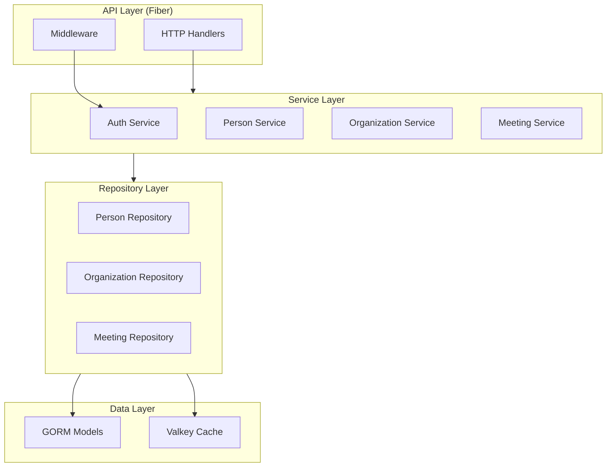

# Backend Contracts and Interfaces

## Overview

This document defines the contracts that the backend layer will conform to, including:
- Service layer interfaces
- Repository interfaces
- API contracts (request/response types)
- Error handling contracts
- Authentication/Authorization contracts

## Architecture Layers



## Repository Interfaces

### PersonRepository

Handles all database operations for Person entities.

```go
package repository

import (
    "context"
    "github.com/google/uuid"
    "github.com/yourorg/meeting-cost/backend/go/internal/models"
)

type PersonRepository interface {
    // Create
    Create(ctx context.Context, person *models.Person) error
    
    // Read
    GetByID(ctx context.Context, id uuid.UUID) (*models.Person, error)
    GetByEmail(ctx context.Context, email string) (*models.Person, error)
    List(ctx context.Context, filters PersonFilters, pagination Pagination) ([]*models.Person, int64, error)
    
    // Update
    Update(ctx context.Context, person *models.Person) error
    
    // Delete (soft delete)
    Delete(ctx context.Context, id uuid.UUID) error
    
    // Anonymization (GDPR)
    Anonymize(ctx context.Context, id uuid.UUID) error
    
    // Relationships
    GetOrganizations(ctx context.Context, personID uuid.UUID) ([]*models.Organization, error)
    GetActiveOrganizations(ctx context.Context, personID uuid.UUID) ([]*models.Organization, error)
}

type PersonFilters struct {
    Email       *string
    Anonymized  *bool
    OrganizationID *uuid.UUID // Filter by organization membership
}
```

### OrganizationRepository

Handles all database operations for Organization entities.

```go
type OrganizationRepository interface {
    // Create
    Create(ctx context.Context, org *models.Organization) error
    
    // Read
    GetByID(ctx context.Context, id uuid.UUID) (*models.Organization, error)
    GetBySlug(ctx context.Context, slug string) (*models.Organization, error)
    List(ctx context.Context, filters OrgFilters, pagination Pagination) ([]*models.Organization, int64, error)
    
    // Update
    Update(ctx context.Context, org *models.Organization) error
    
    // Delete (soft delete)
    Delete(ctx context.Context, id uuid.UUID) error
    
    // Members
    GetMembers(ctx context.Context, orgID uuid.UUID, activeOnly bool) ([]*models.PersonOrganizationProfile, error)
    AddMember(ctx context.Context, profile *models.PersonOrganizationProfile) error
    RemoveMember(ctx context.Context, personID, orgID uuid.UUID) error
    UpdateMemberProfile(ctx context.Context, profile *models.PersonOrganizationProfile) error
    
    // Meetings
    GetMeetings(ctx context.Context, orgID uuid.UUID, filters MeetingFilters, pagination Pagination) ([]*models.Meeting, int64, error)
}

type OrgFilters struct {
    Slug    *string
    Name    *string
    MemberID *uuid.UUID // Filter by member
}
```

### PersonOrganizationProfileRepository

Handles operations for the Person-Organization relationship.

```go
type PersonOrganizationProfileRepository interface {
    // Create
    Create(ctx context.Context, profile *models.PersonOrganizationProfile) error
    
    // Read
    GetByID(ctx context.Context, id uuid.UUID) (*models.PersonOrganizationProfile, error)
    GetByPersonAndOrg(ctx context.Context, personID, orgID uuid.UUID) (*models.PersonOrganizationProfile, error)
    GetByPerson(ctx context.Context, personID uuid.UUID) ([]*models.PersonOrganizationProfile, error)
    GetByOrganization(ctx context.Context, orgID uuid.UUID, activeOnly bool) ([]*models.PersonOrganizationProfile, error)
    
    // Update
    Update(ctx context.Context, profile *models.PersonOrganizationProfile) error
    UpdateWage(ctx context.Context, personID, orgID uuid.UUID, wage float64) error
    
    // Membership
    Activate(ctx context.Context, personID, orgID uuid.UUID) error
    Deactivate(ctx context.Context, personID, orgID uuid.UUID) error
    
    // Delete (soft delete)
    Delete(ctx context.Context, id uuid.UUID) error
}
```

### MeetingRepository

Handles all database operations for Meeting entities.

```go
type MeetingRepository interface {
    // Create
    Create(ctx context.Context, meeting *models.Meeting) error
    
    // Read
    GetByID(ctx context.Context, id uuid.UUID) (*models.Meeting, error)
    GetByExternalID(ctx context.Context, externalType, externalID string) (*models.Meeting, error)
    GetByDeduplicationHash(ctx context.Context, hash string) (*models.Meeting, error)
    List(ctx context.Context, filters MeetingFilters, pagination Pagination) ([]*models.Meeting, int64, error)
    
    // Update
    Update(ctx context.Context, meeting *models.Meeting) error
    Start(ctx context.Context, id uuid.UUID) error
    Stop(ctx context.Context, id uuid.UUID) error
    
    // Delete (soft delete)
    Delete(ctx context.Context, id uuid.UUID) error
    
    // Increments
    GetIncrements(ctx context.Context, meetingID uuid.UUID) ([]*models.Increment, error)
    AddIncrement(ctx context.Context, increment *models.Increment) error
    
    // Participants
    GetParticipants(ctx context.Context, meetingID uuid.UUID) ([]*models.MeetingParticipant, error)
    AddParticipant(ctx context.Context, participant *models.MeetingParticipant) error
    RemoveParticipant(ctx context.Context, meetingID, personID uuid.UUID) error
}

type MeetingFilters struct {
    OrganizationID *uuid.UUID
    CreatedByID    *uuid.UUID
    IsActive       *bool
    StartedAfter   *time.Time
    StartedBefore  *time.Time
    ExternalType   *string
    ExternalID     *string
}
```

### IncrementRepository

Handles operations for Increment entities.

```go
type IncrementRepository interface {
    // Create
    Create(ctx context.Context, increment *models.Increment) error
    CreateBatch(ctx context.Context, increments []*models.Increment) error
    
    // Read
    GetByID(ctx context.Context, id uuid.UUID) (*models.Increment, error)
    GetByMeeting(ctx context.Context, meetingID uuid.UUID) ([]*models.Increment, error)
    
    // Update
    Update(ctx context.Context, increment *models.Increment) error
    
    // Delete (soft delete)
    Delete(ctx context.Context, id uuid.UUID) error
    DeleteByMeeting(ctx context.Context, meetingID uuid.UUID) error
}
```

### AuthRepository

Handles authentication-related database operations.

```go
type AuthRepository interface {
    // AuthMethod operations
    CreateAuthMethod(ctx context.Context, method *models.AuthMethod) error
    GetAuthMethodByID(ctx context.Context, id uuid.UUID) (*models.AuthMethod, error)
    GetAuthMethodByProvider(ctx context.Context, provider, providerID string) (*models.AuthMethod, error)
    GetAuthMethodsByPerson(ctx context.Context, personID uuid.UUID) ([]*models.AuthMethod, error)
    UpdateAuthMethod(ctx context.Context, method *models.AuthMethod) error
    DeleteAuthMethod(ctx context.Context, id uuid.UUID) error
    
    // Session operations
    CreateSession(ctx context.Context, session *models.Session) error
    GetSessionByTokenHash(ctx context.Context, tokenHash string) (*models.Session, error)
    GetSessionsByPerson(ctx context.Context, personID uuid.UUID) ([]*models.Session, error)
    UpdateSession(ctx context.Context, session *models.Session) error
    DeleteSession(ctx context.Context, id uuid.UUID) error
    DeleteExpiredSessions(ctx context.Context) error
    DeleteSessionsByPerson(ctx context.Context, personID uuid.UUID) error
}
```

### ConsentRepository

Handles cookie consent database operations.

```go
type ConsentRepository interface {
    // Create
    Create(ctx context.Context, consent *models.CookieConsent) error
    
    // Read
    GetByID(ctx context.Context, id uuid.UUID) (*models.CookieConsent, error)
    GetCurrentBySession(ctx context.Context, sessionID string) (*models.CookieConsent, error)
    GetCurrentByPerson(ctx context.Context, personID uuid.UUID) (*models.CookieConsent, error)
    GetHistoryBySession(ctx context.Context, sessionID string) ([]*models.CookieConsent, error)
    GetHistoryByPerson(ctx context.Context, personID uuid.UUID) ([]*models.CookieConsent, error)
    
    // Update
    Update(ctx context.Context, consent *models.CookieConsent) error
    
    // Delete (soft delete)
    Delete(ctx context.Context, id uuid.UUID) error
}
```

### PermissionRepository

Handles permission and role operations.

```go
type PermissionRepository interface {
    // Role operations
    CreateRole(ctx context.Context, role *models.Role) error
    GetRoleByID(ctx context.Context, id uuid.UUID) (*models.Role, error)
    GetRolesByOrganization(ctx context.Context, orgID uuid.UUID) ([]*models.Role, error)
    UpdateRole(ctx context.Context, role *models.Role) error
    DeleteRole(ctx context.Context, id uuid.UUID) error
    
    // Permission operations
    CreatePermission(ctx context.Context, permission *models.Permission) error
    GetPermissionByID(ctx context.Context, id uuid.UUID) (*models.Permission, error)
    GetPermissionsByRole(ctx context.Context, roleID uuid.UUID) ([]*models.Permission, error)
    GetPermissionsByPerson(ctx context.Context, personID uuid.UUID) ([]*models.Permission, error)
    GetPermissionsByOrganization(ctx context.Context, orgID uuid.UUID) ([]*models.Permission, error)
    UpdatePermission(ctx context.Context, permission *models.Permission) error
    DeletePermission(ctx context.Context, id uuid.UUID) error
    
    // Role assignment
    AssignRole(ctx context.Context, assignment *models.RoleAssignment) error
    UnassignRole(ctx context.Context, roleID, personID, orgID uuid.UUID) error
    GetRolesByPerson(ctx context.Context, personID, orgID uuid.UUID) ([]*models.Role, error)
    
    // Permission checking
    HasPermission(ctx context.Context, personID, orgID uuid.UUID, resourceName string, resourceID *uuid.UUID, activity string) (bool, error)
}
```

### Common Repository Types

```go
type Pagination struct {
    Page     int
    PageSize int
    SortBy   string
    SortDir  string // "asc" or "desc"
}

func (p Pagination) Offset() int {
    return (p.Page - 1) * p.PageSize
}

func (p Pagination) Limit() int {
    return p.PageSize
}
```

## Service Layer Interfaces

### AuthService

Handles authentication and authorization logic.

```go
package service

import (
    "context"
    "github.com/google/uuid"
    "github.com/yourorg/meeting-cost/backend/go/internal/models"
)

type AuthService interface {
    // Registration
    Register(ctx context.Context, req RegisterRequest) (*RegisterResponse, error)
    VerifyEmail(ctx context.Context, token string) error
    
    // Authentication
    Login(ctx context.Context, req LoginRequest) (*LoginResponse, error)
    Logout(ctx context.Context, token string) error
    RefreshToken(ctx context.Context, refreshToken string) (*TokenResponse, error)
    
    // OAuth
    OAuthLogin(ctx context.Context, provider string, code string) (*LoginResponse, error)
    OAuthCallback(ctx context.Context, provider string, state, code string) (*LoginResponse, error)
    LinkOAuthProvider(ctx context.Context, personID uuid.UUID, provider string, code string) error
    
    // Password management
    ForgotPassword(ctx context.Context, email string) error
    ResetPassword(ctx context.Context, token, newPassword string) error
    ChangePassword(ctx context.Context, personID uuid.UUID, oldPassword, newPassword string) error
    
    // Session management
    ValidateSession(ctx context.Context, token string) (*SessionInfo, error)
    GetSessions(ctx context.Context, personID uuid.UUID) ([]*models.Session, error)
    RevokeSession(ctx context.Context, personID, sessionID uuid.UUID) error
    RevokeAllSessions(ctx context.Context, personID uuid.UUID) error
}

type RegisterRequest struct {
    Email     string `json:"email" validate:"required,email"`
    Password  string `json:"password" validate:"required,min=8"`
    FirstName string `json:"first_name" validate:"required"`
    LastName  string `json:"last_name"`
}

type RegisterResponse struct {
    Person      *models.Person `json:"person"`
    AccessToken string         `json:"access_token"`
    ExpiresIn   int            `json:"expires_in"`
}

type LoginRequest struct {
    Email    string `json:"email" validate:"required,email"`
    Password string `json:"password" validate:"required"`
}

type LoginResponse struct {
    Person       *models.Person `json:"person"`
    AccessToken  string         `json:"access_token"`
    RefreshToken string         `json:"refresh_token"`
    ExpiresIn    int            `json:"expires_in"`
}

type TokenResponse struct {
    AccessToken string `json:"access_token"`
    ExpiresIn   int    `json:"expires_in"`
}

type SessionInfo struct {
    PersonID    uuid.UUID
    Email       string
    ExpiresAt   time.Time
    LastActivity time.Time
}
```

### PersonService

Handles person-related business logic.

```go
type PersonService interface {
    // CRUD
    GetPerson(ctx context.Context, personID uuid.UUID) (*PersonDTO, error)
    UpdatePerson(ctx context.Context, personID uuid.UUID, req UpdatePersonRequest) (*PersonDTO, error)
    
    // Profile
    GetProfile(ctx context.Context, personID uuid.UUID) (*PersonProfileDTO, error)
    UpdateProfile(ctx context.Context, personID uuid.UUID, req UpdateProfileRequest) (*PersonProfileDTO, error)
    
    // Organizations
    GetOrganizations(ctx context.Context, personID uuid.UUID) ([]*OrganizationDTO, error)
    JoinOrganization(ctx context.Context, personID uuid.UUID, orgID uuid.UUID) error
    LeaveOrganization(ctx context.Context, personID uuid.UUID, orgID uuid.UUID) error
    
    // GDPR
    RequestDataExport(ctx context.Context, personID uuid.UUID) (*DataExportResponse, error)
    RequestDeletion(ctx context.Context, personID uuid.UUID) error
    
    // Settings
    UpdateSettings(ctx context.Context, personID uuid.UUID, settings map[string]interface{}) error
}

type PersonDTO struct {
    ID        uuid.UUID `json:"id"`
    Email     string    `json:"email"`
    FirstName string    `json:"first_name"`
    LastName  string    `json:"last_name"`
    CreatedAt time.Time `json:"created_at"`
}

type PersonProfileDTO struct {
    PersonDTO
    Organizations []OrganizationMembershipDTO `json:"organizations"`
    AuthMethods   []AuthMethodDTO            `json:"auth_methods"`
}

type OrganizationMembershipDTO struct {
    OrganizationID uuid.UUID  `json:"organization_id"`
    OrganizationName string   `json:"organization_name"`
    IsActive        bool      `json:"is_active"`
    JoinedAt        time.Time `json:"joined_at"`
    Role            string    `json:"role,omitempty"`
}

type UpdatePersonRequest struct {
    FirstName *string `json:"first_name"`
    LastName  *string `json:"last_name"`
    Timezone  *string `json:"timezone"`
    Locale    *string `json:"locale"`
}
```

### OrganizationService

Handles organization-related business logic.

```go
type OrganizationService interface {
    // CRUD
    CreateOrganization(ctx context.Context, creatorID uuid.UUID, req CreateOrganizationRequest) (*OrganizationDTO, error)
    GetOrganization(ctx context.Context, orgID uuid.UUID, requesterID uuid.UUID) (*OrganizationDTO, error)
    UpdateOrganization(ctx context.Context, orgID uuid.UUID, requesterID uuid.UUID, req UpdateOrganizationRequest) (*OrganizationDTO, error)
    DeleteOrganization(ctx context.Context, orgID uuid.UUID, requesterID uuid.UUID) error
    
    // Members
    GetMembers(ctx context.Context, orgID uuid.UUID, requesterID uuid.UUID) ([]*MemberDTO, error)
    AddMember(ctx context.Context, orgID uuid.UUID, requesterID uuid.UUID, req AddMemberRequest) error
    RemoveMember(ctx context.Context, orgID uuid.UUID, requesterID, memberID uuid.UUID, requesterID uuid.UUID) error
    UpdateMemberWage(ctx context.Context, orgID uuid.UUID, personID uuid.UUID, wage float64, requesterID uuid.UUID) error
    
    // Settings
    UpdateSettings(ctx context.Context, orgID uuid.UUID, requesterID uuid.UUID, settings map[string]interface{}) error
    UpdateDefaultWage(ctx context.Context, orgID uuid.UUID, wage float64, requesterID uuid.UUID) error
    SetBlendedWage(ctx context.Context, orgID uuid.UUID, enabled bool, requesterID uuid.UUID) error
    
    // Permissions
    GetRoles(ctx context.Context, orgID uuid.UUID, requesterID uuid.UUID) ([]*RoleDTO, error)
    CreateRole(ctx context.Context, orgID uuid.UUID, requesterID uuid.UUID, req CreateRoleRequest) (*RoleDTO, error)
    AssignRole(ctx context.Context, orgID uuid.UUID, personID uuid.UUID, roleID uuid.UUID, requesterID uuid.UUID) error
}

type CreateOrganizationRequest struct {
    Name        string  `json:"name" validate:"required"`
    Description string  `json:"description"`
    DefaultWage float64 `json:"default_wage" validate:"min=0"`
}

type OrganizationDTO struct {
    ID            uuid.UUID `json:"id"`
    Name          string    `json:"name"`
    Slug          string    `json:"slug"`
    Description   string    `json:"description"`
    DefaultWage   float64   `json:"default_wage"`
    UseBlendedWage bool     `json:"use_blended_wage"`
    CreatedAt     time.Time `json:"created_at"`
    MemberCount   int       `json:"member_count"`
}

type MemberDTO struct {
    PersonID    uuid.UUID  `json:"person_id"`
    Email       string     `json:"email"`
    FirstName   string     `json:"first_name"`
    LastName    string     `json:"last_name"`
    IsActive    bool       `json:"is_active"`
    HourlyWage  *float64   `json:"hourly_wage,omitempty"` // Only visible to authorized users
    JoinedAt    time.Time  `json:"joined_at"`
    Roles       []string   `json:"roles"`
}

type AddMemberRequest struct {
    PersonID uuid.UUID `json:"person_id" validate:"required"`
    Wage     *float64  `json:"wage"`
}

type CreateRoleRequest struct {
    Name        string   `json:"name" validate:"required"`
    Description string   `json:"description"`
    Permissions []string `json:"permissions"` // List of permission strings like "meeting:create"
}
```

### ConsentService

Handles cookie consent management with full auditability.

```go
type ConsentService interface {
    // Consent management
    GetConsent(ctx context.Context, sessionID string) (*ConsentDTO, error)
    UpdateConsent(ctx context.Context, req UpdateConsentRequest) (*ConsentDTO, error)
    WithdrawConsent(ctx context.Context, sessionID string, cookieTypes []string) error
    
    // Cookie enforcement
    CheckCookieAllowed(ctx context.Context, sessionID string, cookieCategory string) (bool, error)
    ClassifyCookie(cookieName string) string // Returns: "necessary", "analytics", "marketing", "functional"
    
    // Audit and compliance
    GetConsentHistory(ctx context.Context, sessionID string, personID *uuid.UUID) ([]*ConsentDTO, error)
    ExportConsentData(ctx context.Context, personID uuid.UUID) (*ConsentExportDTO, error)
    
    // Policy management
    GetCurrentPolicyVersion(ctx context.Context) (string, error)
}

type UpdateConsentRequest struct {
    SessionID        string   `json:"session_id" validate:"required"`
    PersonID         *uuid.UUID `json:"person_id"`
    AnalyticsCookies bool     `json:"analytics_cookies"`
    MarketingCookies bool     `json:"marketing_cookies"`
    FunctionalCookies bool   `json:"functional_cookies"`
    IPAddress        string   `json:"-"` // Set from request context
    UserAgent        string   `json:"-"` // Set from request context
}

type ConsentDTO struct {
    ID               uuid.UUID  `json:"id"`
    PersonID         *uuid.UUID `json:"person_id,omitempty"`
    SessionID        string     `json:"session_id"`
    NecessaryCookies bool       `json:"necessary_cookies"`
    AnalyticsCookies bool       `json:"analytics_cookies"`
    MarketingCookies bool       `json:"marketing_cookies"`
    FunctionalCookies bool      `json:"functional_cookies"`
    ConsentVersion   string     `json:"consent_version"`
    ConsentDate      time.Time  `json:"consent_date"`
    PreviousConsentID *uuid.UUID `json:"previous_consent_id,omitempty"`
}

type ConsentExportDTO struct {
    PersonID      uuid.UUID     `json:"person_id"`
    Consents      []ConsentDTO  `json:"consents"`
    ExportDate    time.Time     `json:"export_date"`
}
```

### MeetingService

Handles meeting-related business logic.

```go
type MeetingService interface {
    // CRUD
    CreateMeeting(ctx context.Context, orgID uuid.UUID, requesterID uuid.UUID, req CreateMeetingRequest) (*MeetingDTO, error)
    GetMeeting(ctx context.Context, meetingID uuid.UUID, requesterID uuid.UUID) (*MeetingDTO, error)
    UpdateMeeting(ctx context.Context, meetingID uuid.UUID, requesterID uuid.UUID, req UpdateMeetingRequest) (*MeetingDTO, error)
    DeleteMeeting(ctx context.Context, meetingID uuid.UUID, requesterID uuid.UUID) error
    
    // Meeting control
    StartMeeting(ctx context.Context, meetingID uuid.UUID, requesterID uuid.UUID) error
    StopMeeting(ctx context.Context, meetingID uuid.UUID, requesterID uuid.UUID) error
    ResetMeeting(ctx context.Context, meetingID uuid.UUID, requesterID uuid.UUID) error
    
    // Increments
    UpdateAttendeeCount(ctx context.Context, meetingID uuid.UUID, count int, requesterID uuid.UUID) error
    UpdateAverageWage(ctx context.Context, meetingID uuid.UUID, wage float64, requesterID uuid.UUID) error
    UpdatePurpose(ctx context.Context, meetingID uuid.UUID, purpose string, requesterID uuid.UUID) error
    
    // Participants
    AddParticipant(ctx context.Context, meetingID uuid.UUID, personID uuid.UUID, requesterID uuid.UUID) error
    RemoveParticipant(ctx context.Context, meetingID uuid.UUID, personID uuid.UUID, requesterID uuid.UUID) error
    
    // Queries
    ListMeetings(ctx context.Context, orgID uuid.UUID, requesterID uuid.UUID, filters MeetingFilters, pagination Pagination) ([]*MeetingDTO, int64, error)
    GetMeetingCost(ctx context.Context, meetingID uuid.UUID, requesterID uuid.UUID) (*MeetingCostDTO, error)
    
    // Deduplication
    DeduplicateMeeting(ctx context.Context, meetingID uuid.UUID, externalType, externalID string) (*MeetingDTO, error)
}

type CreateMeetingRequest struct {
    OrganizationID uuid.UUID `json:"organization_id" validate:"required"`
    Purpose         string    `json:"purpose"`
    ExternalType    string    `json:"external_type"` // "zoom", "teams", etc.
    ExternalID      string    `json:"external_id"`
}

type UpdateMeetingRequest struct {
    Purpose *string `json:"purpose"`
}

type MeetingDTO struct {
    ID              uuid.UUID     `json:"id"`
    OrganizationID  uuid.UUID     `json:"organization_id"`
    Purpose         string        `json:"purpose"`
    StartedAt       *time.Time    `json:"started_at"`
    StoppedAt       *time.Time    `json:"stopped_at"`
    IsActive        bool          `json:"is_active"`
    TotalCost       float64       `json:"total_cost"`
    TotalDuration   int           `json:"total_duration"` // seconds
    MaxAttendees    int           `json:"max_attendees"`
    Increments      []IncrementDTO `json:"increments,omitempty"`
    Participants    []ParticipantDTO `json:"participants,omitempty"`
    CreatedAt       time.Time     `json:"created_at"`
}

type IncrementDTO struct {
    ID            uuid.UUID `json:"id"`
    StartTime     time.Time `json:"start_time"`
    StopTime      time.Time `json:"stop_time"`
    ElapsedTime   int       `json:"elapsed_time"` // seconds
    AttendeeCount int       `json:"attendee_count"`
    AverageWage   float64   `json:"average_wage"`
    Cost          float64   `json:"cost"`
    TotalCost     float64   `json:"total_cost"`
    Purpose       string    `json:"purpose"`
}

type ParticipantDTO struct {
    PersonID uuid.UUID  `json:"person_id"`
    Email    string     `json:"email"`
    Name     string     `json:"name"`
    JoinedAt *time.Time `json:"joined_at"`
    LeftAt   *time.Time `json:"left_at"`
}

type MeetingCostDTO struct {
    TotalCost     float64 `json:"total_cost"`
    TotalDuration int     `json:"total_duration"` // seconds
    CostPerSecond float64 `json:"cost_per_second"`
    CostPerMinute float64 `json:"cost_per_minute"`
    CostPerHour   float64 `json:"cost_per_hour"`
}
```

## API Contracts

### API Versioning

All API endpoints are versioned:
- Base path: `/api/v1/`
- Version specified in URL path
- Future versions: `/api/v2/`, etc.

### Standard Response Format

```go
type APIResponse struct {
    Success bool        `json:"success"`
    Data    interface{} `json:"data,omitempty"`
    Error   *APIError   `json:"error,omitempty"`
    Meta    *Meta       `json:"meta,omitempty"`
}

type APIError struct {
    Code    string `json:"code"`
    Message string `json:"message"`
    Details map[string]interface{} `json:"details,omitempty"`
}

type Meta struct {
    Pagination *PaginationMeta `json:"pagination,omitempty"`
    RequestID  string          `json:"request_id"`
    Timestamp  time.Time       `json:"timestamp"`
}

type PaginationMeta struct {
    Page       int   `json:"page"`
    PageSize   int   `json:"page_size"`
    TotalItems int64 `json:"total_items"`
    TotalPages int   `json:"total_pages"`
}
```

### Error Codes

Standard error codes for consistent error handling:

```go
const (
    ErrCodeValidation      = "VALIDATION_ERROR"
    ErrCodeNotFound        = "NOT_FOUND"
    ErrCodeUnauthorized    = "UNAUTHORIZED"
    ErrCodeForbidden       = "FORBIDDEN"
    ErrCodeConflict        = "CONFLICT"
    ErrCodeInternal        = "INTERNAL_ERROR"
    ErrCodeRateLimit       = "RATE_LIMIT_EXCEEDED"
    ErrCodeBadRequest      = "BAD_REQUEST"
)
```

### HTTP Status Code Mapping

- `200 OK`: Successful GET, PUT, PATCH
- `201 Created`: Successful POST
- `204 No Content`: Successful DELETE
- `400 Bad Request`: Validation errors, malformed request
- `401 Unauthorized`: Missing or invalid authentication
- `403 Forbidden`: Valid auth but insufficient permissions
- `404 Not Found`: Resource doesn't exist
- `409 Conflict`: Resource conflict (e.g., duplicate email)
- `422 Unprocessable Entity`: Business logic validation errors
- `429 Too Many Requests`: Rate limit exceeded
- `500 Internal Server Error`: Unexpected server error

## Authentication Contracts

### JWT Token Structure

```go
type JWTPayload struct {
    PersonID    uuid.UUID `json:"person_id"`
    Email       string    `json:"email"`
    IssuedAt    int64     `json:"iat"`
    ExpiresAt   int64     `json:"exp"`
    SessionID   uuid.UUID `json:"session_id"`
}
```

### Authorization Header

```
Authorization: Bearer <jwt_token>
```

### OAuth2 Flow

1. **Initiate OAuth**: `GET /api/v1/auth/oauth/{provider}`
   - Returns redirect URL
   - State parameter for CSRF protection

2. **OAuth Callback**: `GET /api/v1/auth/oauth/{provider}/callback?code={code}&state={state}`
   - Exchanges code for tokens
   - Creates/updates AuthMethod
   - Returns JWT tokens

## Request/Response Examples

### Create Meeting

**Request:**
```http
POST /api/v1/meetings
Authorization: Bearer <token>
Content-Type: application/json

{
  "organization_id": "123e4567-e89b-12d3-a456-426614174000",
  "purpose": "Sprint Planning",
  "external_type": "zoom",
  "external_id": "zoom-meeting-123"
}
```

**Response (201 Created):**
```json
{
  "success": true,
  "data": {
    "id": "789e4567-e89b-12d3-a456-426614174000",
    "organization_id": "123e4567-e89b-12d3-a456-426614174000",
    "purpose": "Sprint Planning",
    "started_at": null,
    "stopped_at": null,
    "is_active": false,
    "total_cost": 0,
    "total_duration": 0,
    "max_attendees": 0,
    "created_at": "2024-01-15T10:00:00Z"
  },
  "meta": {
    "request_id": "req-123",
    "timestamp": "2024-01-15T10:00:00Z"
  }
}
```

### Error Response Example

**Response (400 Bad Request):**
```json
{
  "success": false,
  "error": {
    "code": "VALIDATION_ERROR",
    "message": "Invalid request data",
    "details": {
      "organization_id": "required field is missing"
    }
  },
  "meta": {
    "request_id": "req-123",
    "timestamp": "2024-01-15T10:00:00Z"
  }
}
```

## Next Steps

After defining these contracts:
1. Implement repository interfaces with GORM
2. Implement service layer with business logic
3. Create API handlers with Fiber
4. Add request validation middleware
5. Implement error handling middleware
6. Add authentication/authorization middleware
