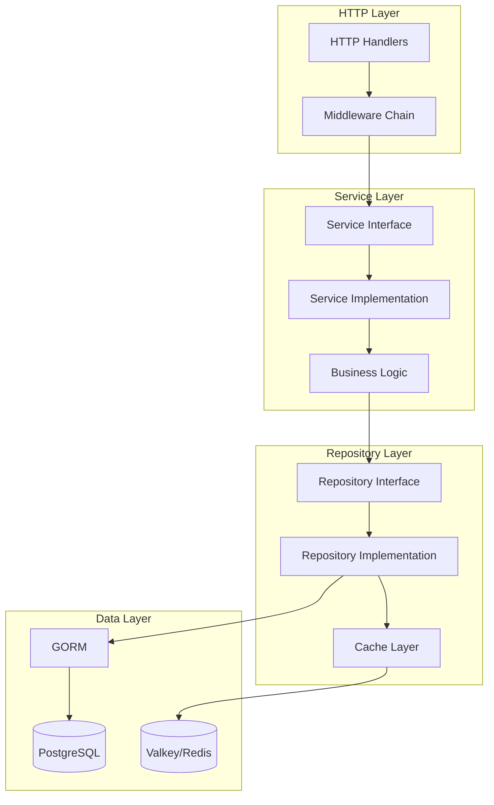

# Backend Patterns and Architecture

## Overview

This document defines the architectural patterns and design principles for how the backend will consume and update business logic. It covers:
- Service layer patterns
- Dependency injection
- Repository pattern implementation
- Business logic patterns
- Error handling patterns
- Caching patterns
- Event-driven patterns
- Immutability patterns

## Architecture Layers



## Dependency Injection Pattern

### Container Structure

Use a dependency injection container to manage service dependencies.

```go
package container

import (
    "context"
    "github.com/yourorg/meeting-cost/backend/go/internal/repository"
    "github.com/yourorg/meeting-cost/backend/go/internal/service"
    "github.com/yourorg/meeting-cost/backend/go/internal/cache"
    "gorm.io/gorm"
)

type Container struct {
    // Database
    DB *gorm.DB
    
    // Cache
    Cache cache.Cache
    
    // Repositories
    PersonRepo     repository.PersonRepository
    OrgRepo        repository.OrganizationRepository
    ProfileRepo    repository.PersonOrganizationProfileRepository
    MeetingRepo    repository.MeetingRepository
    IncrementRepo  repository.IncrementRepository
    AuthRepo       repository.AuthRepository
    PermissionRepo repository.PermissionRepository
    
    // Services
    AuthService    service.AuthService
    PersonService  service.PersonService
    OrgService     service.OrganizationService
    MeetingService service.MeetingService
}

func NewContainer(ctx context.Context, db *gorm.DB, cacheClient cache.Cache) (*Container, error) {
    c := &Container{
        DB:    db,
        Cache: cacheClient,
    }
    
    // Initialize repositories
    c.PersonRepo = repository.NewPersonRepository(db, cacheClient)
    c.OrgRepo = repository.NewOrganizationRepository(db, cacheClient)
    c.ProfileRepo = repository.NewPersonOrganizationProfileRepository(db, cacheClient)
    c.MeetingRepo = repository.NewMeetingRepository(db, cacheClient)
    c.IncrementRepo = repository.NewIncrementRepository(db, cacheClient)
    c.AuthRepo = repository.NewAuthRepository(db, cacheClient)
    c.PermissionRepo = repository.NewPermissionRepository(db, cacheClient)
    
    // Initialize services with dependencies
    c.AuthService = service.NewAuthService(
        c.AuthRepo,
        c.PersonRepo,
        c.PermissionRepo,
    )
    
    c.PersonService = service.NewPersonService(
        c.PersonRepo,
        c.ProfileRepo,
        c.OrgRepo,
        c.PermissionRepo,
    )
    
    c.OrgService = service.NewOrganizationService(
        c.OrgRepo,
        c.ProfileRepo,
        c.PermissionRepo,
        c.MeetingRepo,
    )
    
    c.MeetingService = service.NewMeetingService(
        c.MeetingRepo,
        c.IncrementRepo,
        c.OrgRepo,
        c.ProfileRepo,
        c.PermissionRepo,
    )
    
    return c, nil
}
```

### Service Constructor Pattern

Services receive their dependencies through constructors.

```go
package service

type meetingService struct {
    meetingRepo    repository.MeetingRepository
    incrementRepo  repository.IncrementRepository
    orgRepo        repository.OrganizationRepository
    profileRepo    repository.PersonOrganizationProfileRepository
    permissionRepo repository.PermissionRepository
    cache          cache.Cache
    logger         logger.Logger
}

func NewMeetingService(
    meetingRepo repository.MeetingRepository,
    incrementRepo repository.IncrementRepository,
    orgRepo repository.OrganizationRepository,
    profileRepo repository.PersonOrganizationProfileRepository,
    permissionRepo repository.PermissionRepository,
    cache cache.Cache,
    logger logger.Logger,
) MeetingService {
    return &meetingService{
        meetingRepo:    meetingRepo,
        incrementRepo:  incrementRepo,
        orgRepo:        orgRepo,
        profileRepo:    profileRepo,
        permissionRepo: permissionRepo,
        cache:          cache,
        logger:         logger,
    }
}
```

## Service Layer Pattern

### Service Responsibilities

Services contain business logic and orchestrate repository calls:

1. **Business Logic**: All business rules and validations
2. **Authorization**: Check permissions before operations
3. **Orchestration**: Coordinate multiple repository calls
4. **Transaction Management**: Handle database transactions
5. **Caching**: Manage cache invalidation and updates
6. **Event Publishing**: Emit events for side effects

### Service Method Pattern

```go
func (s *meetingService) CreateMeeting(
    ctx context.Context,
    orgID uuid.UUID,
    requesterID uuid.UUID,
    req CreateMeetingRequest,
) (*MeetingDTO, error) {
    // 1. Authorization check
    hasPermission, err := s.permissionRepo.HasPermission(
        ctx,
        requesterID,
        orgID,
        "meeting",
        nil,
        "create",
    )
    if err != nil {
        return nil, fmt.Errorf("checking permission: %w", err)
    }
    if !hasPermission {
        return nil, ErrForbidden
    }
    
    // 2. Business validation
    if err := s.validateCreateMeeting(ctx, orgID, req); err != nil {
        return nil, fmt.Errorf("validation: %w", err)
    }
    
    // 3. Create entity
    meeting := &models.Meeting{
        OrganizationID: orgID,
        Purpose:        req.Purpose,
        ExternalType:   req.ExternalType,
        ExternalID:     req.ExternalID,
        CreatedByID:    requesterID,
        IsActive:       false,
    }
    
    // 4. Generate deduplication hash if external ID provided
    if req.ExternalID != "" {
        meeting.DeduplicationHash = s.generateDeduplicationHash(
            orgID,
            req.ExternalType,
            req.ExternalID,
        )
    }
    
    // 5. Repository call (with transaction if needed)
    if err := s.meetingRepo.Create(ctx, meeting); err != nil {
        return nil, fmt.Errorf("creating meeting: %w", err)
    }
    
    // 6. Cache invalidation
    s.cache.Delete(ctx, cacheKeyOrganizationMeetings(orgID))
    
    // 7. Event publishing (if needed)
    s.publishEvent(ctx, EventMeetingCreated{
        MeetingID: meeting.ID,
        OrgID:     orgID,
    })
    
    // 8. Return DTO
    return s.toMeetingDTO(meeting), nil
}
```

### Business Logic Validation

Business logic validations are separate from input validation:

```go
func (s *meetingService) validateCreateMeeting(
    ctx context.Context,
    orgID uuid.UUID,
    req CreateMeetingRequest,
) error {
    // Check organization exists and is active
    org, err := s.orgRepo.GetByID(ctx, orgID)
    if err != nil {
        return fmt.Errorf("organization not found: %w", err)
    }
    if org.DeletedAt.Valid {
        return ErrOrganizationDeleted
    }
    
    // Check for duplicate external meeting
    if req.ExternalID != "" {
        existing, err := s.meetingRepo.GetByExternalID(
            ctx,
            req.ExternalType,
            req.ExternalID,
        )
        if err == nil && existing != nil {
            return ErrMeetingAlreadyExists
        }
    }
    
    return nil
}
```

## Repository Pattern Implementation

### Repository with Caching

Repositories implement caching for frequently accessed data:

```go
package repository

type personRepository struct {
    db    *gorm.DB
    cache cache.Cache
}

func NewPersonRepository(db *gorm.DB, cache cache.Cache) PersonRepository {
    return &personRepository{
        db:    db,
        cache: cache,
    }
}

func (r *personRepository) GetByID(ctx context.Context, id uuid.UUID) (*models.Person, error) {
    // 1. Check cache first
    cacheKey := cacheKeyPerson(id)
    var person models.Person
    if err := r.cache.Get(ctx, cacheKey, &person); err == nil {
        return &person, nil
    }
    
    // 2. Query database
    person = models.Person{}
    if err := r.db.WithContext(ctx).
        Where("id = ? AND deleted_at IS NULL", id).
        First(&person).Error; err != nil {
        return nil, fmt.Errorf("getting person: %w", err)
    }
    
    // 3. Cache result
    r.cache.Set(ctx, cacheKey, person, 5*time.Minute)
    
    return &person, nil
}

func (r *personRepository) Update(ctx context.Context, person *models.Person) error {
    // 1. Update database
    if err := r.db.WithContext(ctx).Save(person).Error; err != nil {
        return fmt.Errorf("updating person: %w", err)
    }
    
    // 2. Invalidate cache
    r.cache.Delete(ctx, cacheKeyPerson(person.ID))
    
    return nil
}
```

### Transaction Management

Use transactions for operations that require atomicity:

```go
func (r *meetingRepository) CreateWithIncrements(
    ctx context.Context,
    meeting *models.Meeting,
    increments []*models.Increment,
) error {
    return r.db.WithContext(ctx).Transaction(func(tx *gorm.DB) error {
        // Create meeting
        if err := tx.Create(meeting).Error; err != nil {
            return fmt.Errorf("creating meeting: %w", err)
        }
        
        // Create increments
        for _, inc := range increments {
            inc.MeetingID = meeting.ID
            if err := tx.Create(inc).Error; err != nil {
                return fmt.Errorf("creating increment: %w", err)
            }
        }
        
        return nil
    })
}
```

## Error Handling Pattern

### Custom Error Types

Define custom error types for different error categories:

```go
package errors

import (
    "fmt"
    "github.com/google/uuid"
)

// Domain errors
var (
    ErrNotFound         = &DomainError{Code: "NOT_FOUND", Message: "Resource not found"}
    ErrUnauthorized     = &DomainError{Code: "UNAUTHORIZED", Message: "Unauthorized"}
    ErrForbidden        = &DomainError{Code: "FORBIDDEN", Message: "Forbidden"}
    ErrValidation       = &DomainError{Code: "VALIDATION_ERROR", Message: "Validation failed"}
    ErrConflict         = &DomainError{Code: "CONFLICT", Message: "Resource conflict"}
    ErrMeetingActive    = &DomainError{Code: "MEETING_ACTIVE", Message: "Meeting is currently active"}
)

type DomainError struct {
    Code    string
    Message string
    Details map[string]interface{}
    Cause   error
}

func (e *DomainError) Error() string {
    if e.Cause != nil {
        return fmt.Sprintf("%s: %s: %v", e.Code, e.Message, e.Cause)
    }
    return fmt.Sprintf("%s: %s", e.Code, e.Message)
}

func (e *DomainError) WithDetails(details map[string]interface{}) *DomainError {
    e.Details = details
    return e
}

func (e *DomainError) WithCause(cause error) *DomainError {
    e.Cause = cause
    return e
}

// Helper functions
func ErrPersonNotFound(id uuid.UUID) *DomainError {
    return &DomainError{
        Code:    "PERSON_NOT_FOUND",
        Message: fmt.Sprintf("Person with ID %s not found", id),
        Details: map[string]interface{}{"person_id": id},
    }
}
```

### Error Handling in Services

Services return domain errors that are converted to HTTP responses:

```go
func (s *meetingService) GetMeeting(
    ctx context.Context,
    meetingID uuid.UUID,
    requesterID uuid.UUID,
) (*MeetingDTO, error) {
    meeting, err := s.meetingRepo.GetByID(ctx, meetingID)
    if err != nil {
        if errors.Is(err, gorm.ErrRecordNotFound) {
            return nil, errors.ErrMeetingNotFound(meetingID)
        }
        return nil, fmt.Errorf("getting meeting: %w", err)
    }
    
    // Check permission
    hasPermission, err := s.permissionRepo.HasPermission(
        ctx,
        requesterID,
        meeting.OrganizationID,
        "meeting",
        &meetingID,
        "read",
    )
    if err != nil {
        return nil, fmt.Errorf("checking permission: %w", err)
    }
    if !hasPermission {
        return nil, errors.ErrForbidden
    }
    
    return s.toMeetingDTO(meeting), nil
}
```

### Error Handling in Handlers

Handlers convert domain errors to HTTP responses:

```go
func (h *MeetingHandler) GetMeeting(c *fiber.Ctx) error {
    meetingID, err := uuid.Parse(c.Params("id"))
    if err != nil {
        return c.Status(fiber.StatusBadRequest).JSON(fiber.Map{
            "success": false,
            "error": fiber.Map{
                "code":    "INVALID_ID",
                "message": "Invalid meeting ID",
            },
        })
    }
    
    requesterID := getUserIDFromContext(c)
    
    meeting, err := h.meetingService.GetMeeting(c.Context(), meetingID, requesterID)
    if err != nil {
        return handleError(c, err)
    }
    
    return c.JSON(fiber.Map{
        "success": true,
        "data":    meeting,
    })
}

func handleError(c *fiber.Ctx, err error) error {
    var domainErr *errors.DomainError
    if errors.As(err, &domainErr) {
        statusCode := getStatusCodeForError(domainErr.Code)
        return c.Status(statusCode).JSON(fiber.Map{
            "success": false,
            "error": fiber.Map{
                "code":    domainErr.Code,
                "message": domainErr.Message,
                "details": domainErr.Details,
            },
        })
    }
    
    // Unknown error - log and return generic error
    h.logger.Error("unexpected error", "error", err)
    return c.Status(fiber.StatusInternalServerError).JSON(fiber.Map{
        "success": false,
        "error": fiber.Map{
            "code":    "INTERNAL_ERROR",
            "message": "An unexpected error occurred",
        },
    })
}
```

## Caching Patterns

### Cache Key Strategy

Use consistent cache key patterns:

```go
package cache

const (
    KeyPrefixPerson     = "person:"
    KeyPrefixOrg        = "org:"
    KeyPrefixMeeting    = "meeting:"
    KeyPrefixSession    = "session:"
)

func KeyPerson(id uuid.UUID) string {
    return KeyPrefixPerson + id.String()
}

func KeyOrganization(id uuid.UUID) string {
    return KeyPrefixOrg + id.String()
}

func KeyOrganizationMeetings(orgID uuid.UUID, page, pageSize int) string {
    return fmt.Sprintf("org:%s:meetings:page:%d:size:%d", orgID, page, pageSize)
}

func KeySession(tokenHash string) string {
    return KeyPrefixSession + tokenHash
}
```

### Cache Invalidation Strategy

Invalidate related cache entries when data changes:

```go
func (s *meetingService) UpdateMeeting(
    ctx context.Context,
    meetingID uuid.UUID,
    requesterID uuid.UUID,
    req UpdateMeetingRequest,
) (*MeetingDTO, error) {
    // ... authorization and validation ...
    
    // Update meeting
    if err := s.meetingRepo.Update(ctx, meeting); err != nil {
        return nil, err
    }
    
    // Invalidate related cache entries
    s.cache.Delete(ctx, cache.KeyMeeting(meetingID))
    s.cache.Delete(ctx, cache.KeyOrganizationMeetings(meeting.OrganizationID, 0, 0)) // Invalidate all pages
    s.cache.Delete(ctx, cache.KeyOrganization(meeting.OrganizationID)) // May have cached meeting count
    
    return s.toMeetingDTO(meeting), nil
}
```

### Cache-Aside Pattern

Use cache-aside (lazy loading) pattern:

```go
func (r *personRepository) GetByEmail(ctx context.Context, email string) (*models.Person, error) {
    cacheKey := cache.KeyPersonByEmail(email)
    
    // Try cache first
    var person models.Person
    if err := r.cache.Get(ctx, cacheKey, &person); err == nil {
        return &person, nil
    }
    
    // Cache miss - query database
    person = models.Person{}
    if err := r.db.WithContext(ctx).
        Where("email = ? AND deleted_at IS NULL", email).
        First(&person).Error; err != nil {
        return nil, err
    }
    
    // Store in cache
    r.cache.Set(ctx, cacheKey, person, 5*time.Minute)
    
    return &person, nil
}
```

## Immutability Patterns

### Immutable Value Objects

Use value objects for immutable data:

```go
package valueobject

// Money represents an immutable monetary value
type Money struct {
    amount   float64
    currency string
}

func NewMoney(amount float64, currency string) Money {
    if amount < 0 {
        panic("money amount cannot be negative")
    }
    return Money{
        amount:   amount,
        currency: currency,
    }
}

func (m Money) Amount() float64 {
    return m.amount
}

func (m Money) Currency() string {
    return m.currency
}

func (m Money) Add(other Money) Money {
    if m.currency != other.currency {
        panic("cannot add money with different currencies")
    }
    return NewMoney(m.amount+other.amount, m.currency)
}

// IncrementCost represents the immutable cost calculation for an increment
type IncrementCost struct {
    elapsedTime   int     // seconds
    attendeeCount int
    averageWage   Money
    cost          Money
    totalCost     Money
}

func CalculateIncrementCost(
    elapsedTime int,
    attendeeCount int,
    averageWage Money,
    previousTotal Money,
) IncrementCost {
    // Calculate cost for this increment
    hours := float64(elapsedTime) / 3600.0
    costAmount := hours * float64(attendeeCount) * averageWage.Amount()
    cost := NewMoney(costAmount, averageWage.Currency())
    
    // Calculate running total
    totalCost := previousTotal.Add(cost)
    
    return IncrementCost{
        elapsedTime:   elapsedTime,
        attendeeCount: attendeeCount,
        averageWage:   averageWage,
        cost:          cost,
        totalCost:     totalCost,
    }
}
```

### Immutable Updates

Create new instances instead of mutating:

```go
func (s *meetingService) UpdateAttendeeCount(
    ctx context.Context,
    meetingID uuid.UUID,
    count int,
    requesterID uuid.UUID,
) error {
    // ... authorization ...
    
    meeting, err := s.meetingRepo.GetByID(ctx, meetingID)
    if err != nil {
        return err
    }
    
    if !meeting.IsActive {
        return errors.ErrMeetingNotActive
    }
    
    // Close current increment
    if err := s.closeCurrentIncrement(ctx, meeting); err != nil {
        return err
    }
    
    // Start new increment with new attendee count
    newIncrement := &models.Increment{
        MeetingID:      meetingID,
        StartTime:      time.Now(),
        AttendeeCount:  count,
        AverageWage:    meeting.CurrentAverageWage, // From previous increment or org default
        Purpose:        meeting.Purpose,
    }
    
    if err := s.incrementRepo.Create(ctx, newIncrement); err != nil {
        return err
    }
    
    // Update meeting (immutable update - GORM handles this)
    meeting.CurrentIncrementAttendeeCount = count
    return s.meetingRepo.Update(ctx, meeting)
}
```

## Event-Driven Patterns

### Event Publisher Interface

```go
package events

type EventPublisher interface {
    Publish(ctx context.Context, event Event) error
}

type Event interface {
    Type() string
    Payload() interface{}
}

// Example events
type EventMeetingCreated struct {
    MeetingID uuid.UUID
    OrgID     uuid.UUID
    CreatedBy uuid.UUID
}

func (e EventMeetingCreated) Type() string {
    return "meeting.created"
}

func (e EventMeetingCreated) Payload() interface{} {
    return e
}
```

### Publishing Events from Services

```go
func (s *meetingService) CreateMeeting(
    ctx context.Context,
    orgID uuid.UUID,
    requesterID uuid.UUID,
    req CreateMeetingRequest,
) (*MeetingDTO, error) {
    // ... create meeting ...
    
    // Publish event
    if s.eventPublisher != nil {
        s.eventPublisher.Publish(ctx, events.EventMeetingCreated{
            MeetingID: meeting.ID,
            OrgID:     orgID,
            CreatedBy: requesterID,
        })
    }
    
    return s.toMeetingDTO(meeting), nil
}
```

## Decorator Pattern

### Repository Decorators for Caching

```go
type cachedPersonRepository struct {
    repo  PersonRepository
    cache cache.Cache
}

func NewCachedPersonRepository(repo PersonRepository, cache cache.Cache) PersonRepository {
    return &cachedPersonRepository{
        repo:  repo,
        cache: cache,
    }
}

func (r *cachedPersonRepository) GetByID(ctx context.Context, id uuid.UUID) (*models.Person, error) {
    // Check cache
    cacheKey := cache.KeyPerson(id)
    var person models.Person
    if err := r.cache.Get(ctx, cacheKey, &person); err == nil {
        return &person, nil
    }
    
    // Delegate to underlying repository
    person, err := r.repo.GetByID(ctx, id)
    if err != nil {
        return nil, err
    }
    
    // Cache result
    r.cache.Set(ctx, cacheKey, person, 5*time.Minute)
    
    return person, nil
}

// Delegate all other methods to underlying repository
func (r *cachedPersonRepository) Create(ctx context.Context, person *models.Person) error {
    if err := r.repo.Create(ctx, person); err != nil {
        return err
    }
    r.cache.Delete(ctx, cache.KeyPerson(person.ID))
    return nil
}
```

### Service Decorators for Logging

```go
type loggedMeetingService struct {
    service MeetingService
    logger  logger.Logger
}

func NewLoggedMeetingService(service MeetingService, logger logger.Logger) MeetingService {
    return &loggedMeetingService{
        service: service,
        logger:  logger,
    }
}

func (s *loggedMeetingService) CreateMeeting(
    ctx context.Context,
    orgID uuid.UUID,
    requesterID uuid.UUID,
    req CreateMeetingRequest,
) (*MeetingDTO, error) {
    start := time.Now()
    s.logger.Info("creating meeting", "org_id", orgID, "requester_id", requesterID)
    
    result, err := s.service.CreateMeeting(ctx, orgID, requesterID, req)
    
    duration := time.Since(start)
    if err != nil {
        s.logger.Error("failed to create meeting", "error", err, "duration", duration)
    } else {
        s.logger.Info("meeting created", "meeting_id", result.ID, "duration", duration)
    }
    
    return result, err
}
```

## Factory Pattern

### Factory for Service Creation

```go
package factory

func NewMeetingService(
    db *gorm.DB,
    cache cache.Cache,
    logger logger.Logger,
    eventPublisher events.EventPublisher,
) service.MeetingService {
    // Create repositories
    meetingRepo := repository.NewMeetingRepository(db, cache)
    incrementRepo := repository.NewIncrementRepository(db, cache)
    orgRepo := repository.NewOrganizationRepository(db, cache)
    profileRepo := repository.NewPersonOrganizationProfileRepository(db, cache)
    permissionRepo := repository.NewPermissionRepository(db, cache)
    
    // Create base service
    baseService := service.NewMeetingService(
        meetingRepo,
        incrementRepo,
        orgRepo,
        profileRepo,
        permissionRepo,
        cache,
        logger,
    )
    
    // Wrap with decorators
    loggedService := service.NewLoggedMeetingService(baseService, logger)
    
    // Add event publisher if provided
    if eventPublisher != nil {
        loggedService = service.NewEventPublishingMeetingService(loggedService, eventPublisher)
    }
    
    return loggedService
}
```

## Transaction Management Pattern

### Service-Level Transactions

Services manage transactions for complex operations:

```go
func (s *meetingService) StopMeeting(
    ctx context.Context,
    meetingID uuid.UUID,
    requesterID uuid.UUID,
) error {
    // ... authorization ...
    
    // Use transaction for atomic operation
    return s.db.WithContext(ctx).Transaction(func(tx *gorm.DB) error {
        // Get meeting
        var meeting models.Meeting
        if err := tx.Where("id = ?", meetingID).First(&meeting).Error; err != nil {
            return err
        }
        
        // Close current increment
        if err := s.closeCurrentIncrementTx(ctx, tx, &meeting); err != nil {
            return err
        }
        
        // Update meeting
        meeting.IsActive = false
        meeting.StoppedAt = &time.Time{}
        *meeting.StoppedAt = time.Now()
        
        if err := tx.Save(&meeting).Error; err != nil {
            return err
        }
        
        // Recalculate totals
        if err := s.recalculateMeetingTotalsTx(ctx, tx, &meeting); err != nil {
            return err
        }
        
        return nil
    })
}
```

## Cookie Consent Enforcement Pattern

### Middleware-Based Cookie Filtering

Cookie consent must be enforced at the HTTP middleware level to prevent any cookies from being set without proper consent.

```go
package middleware

import (
    "context"
    "github.com/gofiber/fiber/v2"
    "github.com/yourorg/meeting-cost/backend/go/internal/service"
)

func CookieConsentMiddleware(consentService service.ConsentService, logger logger.Logger) fiber.Handler {
    return func(c *fiber.Ctx) error {
        // Execute handler first
        err := c.Next()
        
        // After handler, filter Set-Cookie headers
        if err == nil {
            filterCookies(c, consentService, logger)
        }
        
        return err
    }
}

func filterCookies(c *fiber.Ctx, consentService service.ConsentService, logger logger.Logger) {
    // Extract session ID from request
    sessionID := extractSessionID(c)
    if sessionID == "" {
        // No session ID - only allow necessary cookies
        filterCookiesByCategory(c, "necessary")
        return
    }
    
    // Get all Set-Cookie headers
    cookies := c.Response().Header.PeekAll("Set-Cookie")
    if len(cookies) == 0 {
        return
    }
    
    // Get consent (with caching)
    consent, err := consentService.GetConsent(c.Context(), sessionID)
    if err != nil {
        // Error or no consent - default to necessary only
        logger.Warn("failed to get consent, defaulting to necessary cookies only", "error", err)
        filterCookiesByCategory(c, "necessary")
        return
    }
    
    // Filter cookies based on consent
    filteredCookies := []string{}
    for _, cookieHeader := range cookies {
        cookieName := extractCookieName(string(cookieHeader))
        category := consentService.ClassifyCookie(cookieName)
        
        // Check if category is allowed
        allowed := isCategoryAllowed(category, consent)
        
        if allowed {
            filteredCookies = append(filteredCookies, string(cookieHeader))
        } else {
            // Log blocked cookie for audit
            logger.Info("cookie blocked due to lack of consent",
                "cookie_name", cookieName,
                "category", category,
                "session_id", sessionID,
            )
        }
    }
    
    // Replace Set-Cookie headers
    c.Response().Header.Del("Set-Cookie")
    for _, cookie := range filteredCookies {
        c.Response().Header.Add("Set-Cookie", cookie)
    }
}

func isCategoryAllowed(category string, consent *service.ConsentDTO) bool {
    switch category {
    case "necessary":
        return true // Always allowed
    case "analytics":
        return consent.AnalyticsCookies
    case "marketing":
        return consent.MarketingCookies
    case "functional":
        return consent.FunctionalCookies
    default:
        return false // Unknown category - block by default
    }
}

func extractSessionID(c *fiber.Ctx) string {
    // Try cookie first
    if sessionCookie := c.Cookies("session_id"); sessionCookie != "" {
        return sessionCookie
    }
    
    // Try header
    if sessionHeader := c.Get("X-Session-ID"); sessionHeader != "" {
        return sessionHeader
    }
    
    // Generate new session ID for anonymous users
    // (This should be done earlier in the request lifecycle)
    return ""
}
```

### Cookie Classification

Cookies must be classified into categories for consent checking:

```go
package consent

type CookieClassifier struct {
    rules map[string]string // cookie pattern -> category
}

func NewCookieClassifier() *CookieClassifier {
    return &CookieClassifier{
        rules: loadCookieRules(), // From config file
    }
}

func (cc *CookieClassifier) Classify(cookieName string) string {
    // Check rules in order (most specific first)
    for pattern, category := range cc.rules {
        if matches(pattern, cookieName) {
            return category
        }
    }
    
    // Default to necessary for unknown cookies (fail-safe)
    return "necessary"
}

// Example rules:
// "_ga*" -> "analytics"
// "_gid*" -> "analytics"
// "session*" -> "necessary"
// "auth*" -> "necessary"
// "*_marketing" -> "marketing"
// "preferences*" -> "functional"
```

### Performance Considerations

- **Cache consent lookups**: Use Redis cache to avoid database hits on every request
- **Batch cookie filtering**: Process all Set-Cookie headers in one pass
- **Early exit**: If no Set-Cookie headers, skip processing
- **Default behavior**: When consent unavailable, only allow necessary cookies

### Audit Trail

All blocked cookie attempts should be logged for compliance:
- Cookie name
- Cookie category
- Session ID
- Timestamp
- Reason (no consent, consent withdrawn, etc.)

## Next Steps

After understanding these patterns:
1. Implement repository layer with caching
2. Implement service layer with business logic
3. Add decorators for cross-cutting concerns
4. Implement event publishing
5. Add transaction management
6. Create factories for dependency injection
7. Implement cookie consent enforcement middleware